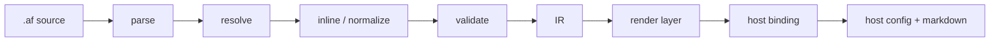

# AgentFlow

> A small declarative language for describing multi-agent systems and compiling
> them into working agents on hosts like Claude Code and Cursor.

This is the high-level map. For the language definition see
[spec/grammar.md](spec/grammar.md); for implementation detail see
[plans/](plans/). The canonical MVP program is [examples/review.af](examples/review.af).

---

## What it is

You describe an agent team once in a `.af` file — the agents, what they can do,
their typed outputs, and how they collaborate. AgentFlow validates it and
generates the platform-native configuration for your host, including a slash
command (e.g. `/ship`) that kicks the whole thing off.

AgentFlow is a **compiler / scaffolder, not a runtime**. It never executes agents
or makes network calls. Orchestration happens on the host: the host's agent
follows generated instructions (and, optionally later, a generated program drives
an SDK deterministically).

## The one big idea

> **Everything is a flow.** An agent is an atomic flow (`In -> Out`). A flow is a
> composition of flows. A subflow is just a flow referenced by name.

Patterns (supervisor, fan-out, consensus) are **library flows**, not keywords.

## Data identity (the load-bearing wall)

Control flow is useless without knowing **what value** each step produces and
**who receives it**. AgentFlow defines this explicitly:

- **Control labels** — each agent/gate/subflow occurrence has a stable runbook
  label.
- **Value labels** — `ref as value` names the latest output slot used by branches,
  loops, and `return:`.
- **Latest output** — agents with `out: Enum` emit a parsed enum value; others
  emit text. Conditions use `review == approve`, not free-form expressions.
- **Flow I/O** — `in:` / `out:` declare types; `return: valueLabel` binds a flow's
  output to a specific value (no "last step wins").
- **Gather payload** — parallel branches produce a labeled bundle passed to the
  gather step alongside sequential context.
- **Output protocol** — a fenced `agentflow-output` block with `out: <enum>`;
  parse failures retry then halt.

Full rules: [spec/grammar.md §4](spec/grammar.md#4-execution-and-data-model).

## Language levels

One grammar, three semantic levels (see [spec §3](spec/grammar.md#3-language-levels)):

| Level | What | When |
|-------|------|------|
| **A — v0.1 subset** | sequence, branch, loop, `repeat`/`until`, parallel/gather, subflows, enums, opaque `in:`, default `return:` | MVP |
| **B — parsed, disabled** | flow params, calls, `each`, `it` | v0.2 (M9) |
| **C — post-MVP** | records, policies, tests, registry, SDK | v0.3+ |

No semicolons. Level B syntax may parse in v0.1 but the resolver rejects it.

## The kernel

- **Sequence** — `a -> b`
- **Selection** — `branch value { case v -> ... }`
- **Iteration** — `loop (until value == v, max N) { ... }` (while) or
  `repeat { ... } until (value == v, max N)` (do-while)
- **Concurrency** — `parallel { ... } gather g as value`
- **Reference** — bare name (agent or subflow)
- **Abstraction** — Level B (`flow F(params)`, calls)

## Guiding principles

1. Small typed kernel, open periphery.
2. Composition is the primitive; patterns are libraries.
3. Typed contracts + output protocol drive routing.
4. Composition, not computation (no expression language).
5. Capability negotiation with honest fallbacks.
6. Determinism is a spectrum by target (see below).
7. Tooling-first, diagnostics-first.

## Canonical example

From [examples/review.af](examples/review.af) (abbreviated):

```text
type Verdict = approve | revise | reject
type Decision = shipped | rejected

agent reviewer {
  model: opus
  out: Verdict
  prompt: "..."
}

gate quality {
  run: "scripts/test.sh"
  on-fail: retry
  on-fail-target: build
}

flow code_review {
  in: Ticket
  out: Verdict
  return: review
  build
  quality
  parallel {
    lint
    security
    style
  } gather reviewer as review
  loop (until review != revise, max 3) {
    build
    quality
    reviewer as review
  }
}

entry flow ship {
  on: "/ship"
  in: Ticket
  out: Decision
  code_review
  branch code_review {
    case approve -> deploy
    case revise  -> notify_author
    case reject  -> notify_author
  }
}
```

## Architecture examples

The same kernel expresses the common multi-agent shapes — patterns are
compositions, not keywords:

| Architecture | Example | Kernel used |
|--------------|---------|-------------|
| Sequential pipeline | [examples/pipeline.af](examples/pipeline.af) | `a -> b -> c -> d`, default `return:` |
| Supervisor / worker fan-out | [examples/research.af](examples/research.af) | `parallel { ... } gather` |
| Generator / critic | [examples/critic.af](examples/critic.af) | `repeat { ... } until` |
| Review + ship (all of the above) | [examples/review.af](examples/review.af) | subflow, gate, branch, loop |
| CL review (dogfooded, Cursor models) | [examples/cl-review.af](examples/cl-review.af) | `a -> b`, `use cursor` model-provider |

---

## End-to-end flow

### Compile time



The `af` CLI drives the front of this pipeline today (`af validate`, `af graph`,
`af build --target cursor`, `af build --emit-ir`). The Cursor binding is the
shipped back end; Claude Code is next.

### Run time

User types `/ship TICKET-123` (or `/cl-review <PR>`). The host orchestrator
follows the generated runbook, dispatches the native subagents, parses
`agentflow-output` blocks, and enforces gates via hooks where supported (advisory
on Cursor today).

### Output protocol (summary)

Agents with enum `out:` end with:

````
```agentflow-output
out: approve
```
````

Parse failure → retry up to `retry:` → halt. Details: [spec §9](spec/grammar.md#9-output-protocol-contract).

---

## Host capability matrix

Status: **Cursor — shipped** (native subagents); **Claude Code — planned (M7)**;
**SDK — post-MVP (M15)**.

| Capability | Cursor (shipped) | Claude Code (M7) | SDK (M15) |
|------------|------------------|------------------|-----------|
| Slash command | yes | yes | CLI |
| Named subagents | yes (`.cursor/agents/*.md`) | yes | yes |
| MCP emission | yes (`.cursor/mcp.json`) | yes | yes |
| Blocking gates | advisory (`AF303`) | hooks | hard |
| Parallel spawn | advisory (`AF300`) | advisory | hard |
| Deterministic control flow | no | no | yes |

Full matrix: [spec §11](spec/grammar.md#11-host-capability-matrix-v01).

## Runtime guarantees by target

| | Native runbook | Hook-enforced | SDK runtime |
|---|----------------|---------------|-------------|
| Control flow | best-effort | best-effort + gates | deterministic |
| Loop bounds | advisory | partial | hard |
| Output parse | advisory | advisory | hard |

Details: [spec §12](spec/grammar.md#12-runtime-guarantees-by-target).

## Status

The MVP pipeline is **working end to end for Cursor**: the `af` CLI parses,
resolves, inlines, validates, lowers to IR, renders, and binds
[examples/review.af](examples/review.af) into a `.cursor/` config, covered by
golden + end-to-end tests. Claude Code binding (M7) and config import (M17) are
the next steps; full roadmap in [WALKTHROUGH.md §6](WALKTHROUGH.md#6-after-the-mvp-future-extensions)
and [plans/](plans/).
