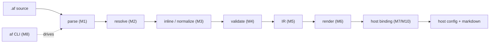

# AgentFlow MVP Walkthrough

> A friendly, high-level tour of what AgentFlow is, the milestones that build the
> MVP, what each component does, how they fit together, and where it goes after MVP.
>
> For the formal language definition see [spec/grammar.md](spec/grammar.md). For the
> architecture map see [OVERVIEW.md](OVERVIEW.md). For milestone detail see
> [plans/](plans/). This doc is the plain-English bridge between them.

---

## 1. What AgentFlow is (in one minute)

You write a single `.af` file describing a team of AI agents — who they are, what
tools they have, what typed output they produce, and how they hand work to each
other. AgentFlow **compiles** that file into the native configuration your host
needs (Claude Code first; **Cursor binding also available** — see M10), including a slash
command like `/ship` that runs the whole team.

The key mental model:

> **AgentFlow is a compiler, not a runtime.** It never calls a model or runs an
> agent. It generates instructions and config. The *host* (Claude Code) does the
> actual orchestration at runtime.

The one big idea behind the language:

> **Everything is a flow.** An agent is an atomic flow (`In -> Out`). A bigger flow
> is just a composition of smaller flows. Common patterns (supervisor, fan-out,
> critic loops) are *compositions*, not special keywords.

A tiny taste from [examples/review.af](examples/review.af):

```text
entry flow ship {
  on: "/ship"
  in: Ticket
  out: Decision
  code_review
  branch code_review {
    case approve -> deploy
    case revise  -> notify_author
    case reject  -> notify_author
  }
}
```

This says: when someone types `/ship`, run the `code_review` subflow, then branch
on its verdict — ship it, or notify the author.

---

## 2. The compiler pipeline (the spine everything hangs off)

Every milestone is a stage in one straight-line pipeline. Source text goes in the
left, host files come out the right:



Each stage only consumes the output of the one before it. That's why the
milestones are numbered the way they are — they build the pipeline front to back.

**Where the build stands today:** M0–M6 are **done** (parse through render). **M10 Cursor
binding** (lean cut, PR #10) assembles `.cursor/` from IR + render but is not yet wired
to the CLI. **M7 Claude binding** and **M8 CLI** (`af validate`, `af build`, `af graph`)
are still planned — they complete the MVP path for Claude Code and expose Cursor via
`af build --target cursor`.

---

## 3. The MVP milestones (M0–M8)

The MVP is "Level A" of the language — the executable v0.1 subset. Here is each
milestone, what it builds, and why it matters. Status reflects the current repo.

### M0 — Foundations · ✅ Done

**What it builds:** the plumbing every later stage reuses — structured
diagnostics, an in-memory output file set, the binding interface, and a CLI
skeleton.

- `internal/diag/` — every compiler message is a structured `Diagnostic` with a
  code (`AF000`, `AF110`, …), severity, message, and source position. No raw
  `panic`; every pass returns diagnostics.
- `internal/emit/` — an ordered, in-memory set of files the binding will write,
  with deterministic sorted paths and a `Flush(dir)` to disk.
- `internal/binding/` — the `Binding` interface (`Name`, `Capabilities`, `Emit`)
  that hosts implement later.

**Why first:** nothing here is AgentFlow-specific logic, but everything downstream
depends on it.

### M1 — Lexer & Parser · ✅ Done

**What it builds:** turns `.af` text into an AST (abstract syntax tree) using the
`participle` parser library — with positioned errors and no panics on bad input.

- `internal/parser/` — lexer + parser. Entry point: `parser.Parse(filename, src)`.
- `internal/ast/` — the AST node types and their JSON snapshot form.

**Key trait:** the grammar is deliberately loose. Agents and gates are generic
"field bags," so unknown fields can be preserved rather than rejected. Note: there
are **no semicolons** — one step per line.

### M2 — Resolver & Semantic Model · ✅ Done

**What it builds:** lowers the loose AST into a typed **semantic model** with
symbol tables — interpreting each block according to its kind (agent, gate, type,
flow).

- `internal/sema/` — the resolver. Entry point: `sema.Resolve(ast, srcDir)`.
- `internal/model/` — the typed `Program`: maps of capabilities, types, agents,
  gates, flows, plus the entry flow.

This is where:
- models/providers get resolved (e.g. `opus` → the anthropic provider) — spec §8,
- prompt files (`prompt-file: "..."`) get read from disk,
- gate failure policy (`on-fail: retry`, `on-fail-target: build`) is parsed,
- flow `return:` bindings are recorded,
- Level B syntax (the v0.2 stuff) is rejected with `AF150`.

Unknown fields **warn but are kept** for forward compatibility.

### M3 — Inline & Normalize · ✅ Done

**What it builds:** the **Resolved flow** — a fully expanded tree of kernel-only
constructs plus the "data identity" metadata that the rest of the pipeline needs.

- `internal/flowgraph/` — entry point: `flowgraph.Resolve(program)`.

This single mandatory transform:
- **inlines subflows** (e.g. `code_review` gets expanded inline) and **prefixes
  labels** so names stay unique,
- assigns **control labels** (a stable runbook name per step) and **value labels**
  (`reviewer as review` names an output slot),
- builds **gather payloads** for `parallel { … } gather`,
- wires **return bindings** (which value a flow actually returns),
- detects cycles (`AF212`).

**Why it matters:** validation, IR, rendering, and the DOT graph all read this
resolved tree — not the raw AST. It's the load-bearing representation.

### M4 — Validation · ✅ Done

**What it builds:** the v0.1 rule set (`AF200`–`AF211`) over the resolved flow,
producing clear, actionable diagnostics — e.g. branch cases that don't match an
enum, missing producers, unreachable steps. Runs *after* inlining so it sees the
fully expanded graph.

- `internal/validate/` — rule engine over resolved flow + model.

### M5 — IR (Intermediate Representation) · ✅ Done

**What it builds:** a normalized, **binding-agnostic** IR with deterministic JSON.

- `internal/ir/` — `FromResolved`, JSON marshal/unmarshal, golden fixtures.

The IR is the **stable contract** between the front end and the back end.
Everything downstream (render, every host binding) consumes the IR — never the AST
or model. That decoupling is what lets new hosts be added later without touching
the parser.

### M6 — Rendering Layer · ✅ Done

**What it builds:** the host-agnostic "what to say" layer — turning IR into the
natural-language text that lands in generated markdown:

- runbook steps (the ordered instructions the host agent follows),
- subagent prompts, including the **output protocol** (the fenced
  `agentflow-output` block agents must emit, spec §9),
- neutral frontmatter values.

- `internal/render/` — `Vocabulary` interface, `runbook.go`, `prompt.go`, `protocol.go`.

Render decides *what to say*; bindings decide *where to put it*.

### M7 — Claude Code Binding · ⏳ Planned

**What it builds:** assembles the render output into a working `.claude/`
directory:

- `internal/binding/claude/` — `.claude/commands/ship.md`, agent files,
  `.mcp.json`, settings/hooks.

Typing `/ship` then runs the flow via the native runbook (best-effort control
flow), with **hook-enforced blocking gates** where the host supports them.

> **Note:** Cursor binding (M10 lean cut) landed first in PR #10; Claude (M7) is
> still the MVP primary target per the original milestone order.

### M10 — Cursor Binding · 🔶 Partial (lean cut)

**What it builds:** assembles render output into `.cursor/commands/`, `.cursor/rules/*.mdc`,
and `.cursor/mcp.json`. Agents become rules (no native subagents); parallel and blocking
gates use advisory fallbacks with `AF3xx` warnings.

- `internal/binding/cursor/` — **done** in PR #10; not yet exposed via CLI.

**Remaining:** hooks.json, shared negotiation framework, `BUILD-NOTES.md` — see
[implementation-plans/2026-06-19-m10-cursor-binding.md](implementation-plans/2026-06-19-m10-cursor-binding.md).

### M8 — CLI & End-to-End · ⏳ Planned

**What it builds:** wires the whole pipeline behind the `af` binary and proves the
MVP works end to end.

- `cmd/af/` — `af validate`, `af build --target claude-code|cursor`, `af graph`.
- A `pipeline.Compile(path)` that runs parse → resolve → inline → validate → IR.

**MVP "definition of done"** (all must pass on `examples/review.af`):
- `af validate` — zero errors,
- `af graph` — DOT with prefixed subflow labels and gather edges,
- `af build --target claude-code` — produces the `.claude/` config (after M7),
- `af build --target cursor` — produces the `.cursor/` config (binding ready),
- the runbook implements the §9 output protocol and gate retry-to-`build`,
- the E2E test is green, with all goldens tied to the one canonical file.

---

## 4. How it all fits together (the worked example)

Walk `examples/review.af` through the finished pipeline to see the pieces connect:

1. **Author** writes the `.af`: agents (`build`, `lint`, `reviewer`, `deploy`…), a
   `quality` gate, a `code_review` flow, and an `entry flow ship` with `on: "/ship"`.
2. **Parse (M1)** → AST. (Level B syntax would parse but get rejected later.)
3. **Resolve (M2)** → semantic model: `opus`/`sonnet`/`haiku` resolve to the
   anthropic provider, `reviewer`'s prompt is read from `prompts/reviewer.md`, the
   gate's `on-fail: retry → build` policy is parsed.
4. **Inline (M3)** → resolved flow: `code_review` is inlined into `ship`, labels
   are assigned, the `parallel { lint, security, style } gather reviewer as review`
   produces a gather payload, and the `loop (until review != revise, max 3)` is
   wired.
5. **Validate (M4)** → confirms branch cases (`approve`/`revise`/`reject`) match
   the `Verdict` enum, every reference resolves, etc.
6. **IR (M5)** → a JSON description of agents, the flow graph, and data-flow
   metadata.
7. **Render (M6)** → runbook prose + agent prompts with `agentflow-output` blocks.
8. **Bind (M7/M10)** → host config (`.claude/` or `.cursor/`).
9. **CLI (M8)** → `af build` ties it together.

**At runtime (outside AgentFlow):** a developer types `/ship TICKET-123` in Claude
Code. The host follows the generated runbook: runs `build`, runs the `quality`
gate (retrying back to `build` on failure), fans out the three reviewers in
parallel, gathers a verdict, loops up to 3 times while the verdict is `revise`,
then branches to `deploy` or `notify_author`. Gates are enforced by hooks where
supported.

### The same kernel, many shapes

The four example files show that common architectures are just compositions of the
same small kernel — no new keywords:

| Architecture | Example | Kernel used |
|--------------|---------|-------------|
| Sequential pipeline | [examples/pipeline.af](examples/pipeline.af) | `a -> b -> c`, default `return:` |
| Supervisor / worker fan-out | [examples/research.af](examples/research.af) | `parallel { … } gather` |
| Generator / critic | [examples/critic.af](examples/critic.af) | `repeat { … } until` |
| Review + ship (all of it) | [examples/review.af](examples/review.af) | subflow, gate, branch, loop |

`review.af` is the **canonical golden fixture**: the spec, all snapshot tests, and
the MVP acceptance criteria reference it. Change it → re-gold the tests.

---

## 5. The data-identity backbone (why this works at all)

Control flow is useless unless you know *what value* each step produces and *who
receives it*. The MVP makes this explicit (spec §4), and it's why M3 exists as its
own milestone:

- **Control labels** — a stable runbook name for each agent/gate/subflow occurrence.
- **Value labels** — `ref as value` names the latest-output slot used by branches,
  loops, and `return:`.
- **Latest output** — agents with `out: Enum` emit a parsed enum; conditions are
  `review == approve`, never free-form expressions (composition, not computation).
- **Flow I/O** — `in:` / `out:` declare types; `return: valueLabel` binds the
  flow's output explicitly (no "last step silently wins").
- **Gather payload** — parallel branches produce a labeled bundle passed to the
  gather step.
- **Output protocol** — agents end with a fenced `agentflow-output` block; a parse
  failure retries, then halts.

---

## 6. After the MVP (M9 onward)

Once M0–M8 land, AgentFlow grows along three axes. There's one grammar with three
semantic levels: **A** (MVP, today), **B** (parses now, enabled in M9), **C**
(post-MVP new syntax).

| # | Milestone | Version | What it adds |
|---|-----------|---------|--------------|
| M9 | Abstraction & std/patterns | v0.2 (Level B) | flow parameters, calls, `each`, `it`, a `std.patterns` library |
| M10 | Cursor & Negotiation | v0.2 | **Partial** — lean Cursor binding (PR #10); hooks + shared negotiation remain |
| M11 | Registry, Formatter, Diagnostics | v0.2 | a component registry, `af fmt`, richer diagnostics |
| M12 | Records & Multi-output | v0.3 (Level C) | record types, agents with multiple outputs, dotted branches |
| M13 | Policies & Metering | v0.4 | execution policies and usage metering |
| M14 | Plan IR & Simulator | v0.5 | a Plan IR, a simulator, and `af test` |
| M15 | SDK Runtime | v0.5+ | opt-in `--runtime sdk`: a generated deterministic orchestrator with *hard* control flow, gates, parallelism, and loop bounds |
| M16 | LSP | v0.5+ | editor support — diagnostics, go-to-def, formatting |

**The throughline — determinism is a spectrum by target.** The MVP's Claude
binding follows the runbook *best-effort* with hook-enforced gates. The later SDK
runtime (M15) generates a program that drives the flow *deterministically*. Same
`.af` source; stronger guarantees as the target improves:

| Capability | Claude Code (MVP) | Cursor (M10) | SDK (M15) |
|------------|-------------------|--------------|-----------|
| Slash command | yes | yes | CLI |
| Blocking gates | hooks | advisory | hard |
| Deterministic control flow | no | no | yes |

**Why the architecture extends cleanly:** the IR (M5) is the stable, binding-agnostic
contract. New hosts (Cursor, SDK) are new *bindings* that consume the same IR;
new language features (Level B/C) extend the front end and IR. The parser never
needs to know about hosts, and hosts never need to know about syntax.

---

## 7. Quick reference

**Pipeline:** parse → resolve → inline → validate → IR → render → bind.

**Status:** M0–M6 done · M10 Cursor binding (lean) done · M7 + M8 complete the MVP · M9+ post-MVP.

**Code map:**

| Stage | Package | Status |
|-------|---------|--------|
| Diagnostics / emit / binding iface | `internal/diag`, `internal/emit`, `internal/binding` | ✅ M0 |
| Parser / AST | `internal/parser`, `internal/ast` | ✅ M1 |
| Resolver / model | `internal/sema`, `internal/model` | ✅ M2 |
| Inline / normalize | `internal/flowgraph` | ✅ M3 |
| Validation | `internal/validate` | ✅ M4 |
| IR | `internal/ir` | ✅ M5 |
| Render | `internal/render` | ✅ M6 |
| Claude binding | `internal/binding/claude` | ⏳ M7 |
| Cursor binding | `internal/binding/cursor` | 🔶 M10 lean |
| CLI / pipeline | `cmd/af`, `internal/pipeline` | ⏳ M8 |

**Docs:** [README.md](README.md) (intro) · [OVERVIEW.md](OVERVIEW.md) (architecture) ·
[spec/grammar.md](spec/grammar.md) (language) · [plans/](plans/) (milestone detail) ·
[examples/review.af](examples/review.af) (canonical program).
