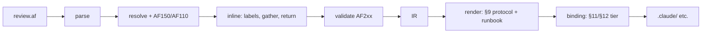
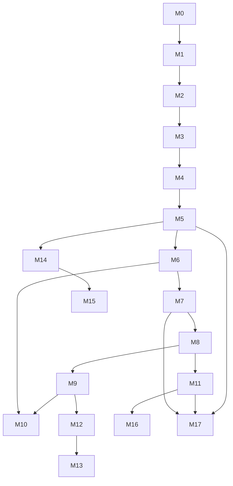

# AgentFlow Implementation Plans

Milestone-by-milestone implementation plan for AgentFlow, grounded in
[../spec/grammar.md](../spec/grammar.md) and [../OVERVIEW.md](../OVERVIEW.md).

**Canonical golden fixture:** [../examples/review.af](../examples/review.af) — the
spec (§14), all golden snapshots, E2E tests, and acceptance criteria in these plans
reference this file. Regold tests when it changes.

**Supplementary architecture fixtures (Level A):**
[../examples/pipeline.af](../examples/pipeline.af) (sequential),
[../examples/cl-review.af](../examples/cl-review.af) (CL review: reviewer → executor),
[../examples/research.af](../examples/research.af) (supervisor/worker fan-out),
[../examples/critic.af](../examples/critic.af) (generator/critic),
[../examples/docs.af](../examples/docs.af) (prompts from markdown files), and
[../examples/cl-review.af](../examples/cl-review.af) (dogfooded CL-review pipeline
with `use cursor` model bindings). These exercise the v0.1 ergonomic features —
`repeat { ... } until` (do-while), **default `return:`** (terminal producer, spec
§4.4 Rule 0), **prompt-as-path** in the `prompt:` field (spec §7.3.1), and host
**model-provider** bindings (spec §8) — and get golden AST/IR/render snapshots
alongside `review.af`. `review.af` remains the regold anchor.

Stack: Go + `github.com/alecthomas/participle/v2`. Binary `af`.

## Language levels (implementation scope)

| Level | Milestones | Compiler behavior |
|-------|------------|-------------------|
| **A — v0.1 subset** | M0–M8 | Fully executable; see [spec §3.1](../spec/grammar.md#31-level-a--v01-semantic-subset-mvp) |
| **B — parsed, disabled until M9** | M9–M11 | Parse OK; `AF150` at resolve until M9 enables semantics |
| **C — post-MVP** | M12–M16 | New syntax per [spec §3.3](../spec/grammar.md#33-level-c--post-mvp-syntax) |

**No semicolons** in source (spec §3.4). One step per line.

## Spec sections each milestone must honor

| Topic | Spec | Primary milestones |
|-------|------|-------------------|
| Execution / data model | §4 | M2, M3, M4, M5, M6 |
| Output protocol | §9 | M6, M7, M14, M15 |
| Model resolution | §8 | M2, M5, M7 |
| Gate failure policy | §7.4.1 | M2, M4, M6, M7, M14, M15 |
| Flow `return:` binding | §4.4 | M2, M3, M4, M5 |
| Host capability matrix | §11 | M7, M10 |
| Runtime guarantees | §12 | M7, M10, M15 |
| Golden program | §14 | M1, M4, M8, all goldens |

## How to read milestone docs

Each doc includes: **Goal**, **Scope**, **Packages**, **Tasks**, **Data shapes**,
**Acceptance**, **Dependencies**, **Risks** — plus **Language Level**, **Spec** links,
and references to `examples/review.af` where applicable.

## Status legend

`Planned` | `In progress` | `Done`. The MVP is **working end to end for Cursor**:
M0–M6, M8, and M10 are **Done**; M7 (Claude binding) is the next target.

## Index

### MVP (v0.1) — Level A

| # | Doc | Delivers | Status |
|---|-----|----------|--------|
| M0 | [00 - Foundations](mvp/00-foundations.md) | diag, emit FS, binding interface | ✅ Done |
| M1 | [01 - Lexer & Parser](mvp/01-lexer-and-parser.md) | AST, no semicolons | ✅ Done |
| M2 | [02 - Resolver & Model](mvp/02-resolver-and-model.md) | model, §8 models, gate on-fail, `return:` | ✅ Done |
| M3 | [03 - Inline & Normalize](mvp/03-inline-and-normalize.md) | control/value labels, gather payloads, return wiring | ✅ Done |
| M4 | [04 - Validation](mvp/04-validation.md) | AF200–AF210 | ✅ Done |
| M5 | [05 - IR](mvp/05-ir.md) | JSON IR + data model metadata | ✅ Done |
| M6 | [06 - Rendering Layer](mvp/06-rendering-layer.md) | runbook + §9 protocol text | ✅ Done |
| M7 | [07 - Claude Code Binding](mvp/07-binding-claude-code.md) | `.claude/` + §11/§12 tiers | ⏳ Planned (next) |
| M8 | [08 - CLI & E2E](mvp/08-cli-and-e2e.md) | `af` CLI + MVP done (Cursor path) | ✅ Done |

### Post-MVP

| # | Doc | Version | Status |
|---|-----|---------|--------|
| M9 | [09 - Abstraction & std/patterns](post-mvp/09-abstraction-and-stdlib.md) | v0.2 Level B | Planned |
| M10 | [10 - Cursor & Negotiation](post-mvp/10-cursor-and-negotiation.md) | v0.2 | ✅ Done (native subagents) |
| M11 | [11 - Registry, Formatter, Diagnostics](post-mvp/11-registry-formatter-diagnostics.md) | v0.2 | Planned |
| M12 | [12 - Records & Multi-output](post-mvp/12-records-and-multi-output.md) | v0.3 Level C | Planned |
| M13 | [13 - Policies & Metering](post-mvp/13-policies-and-metering.md) | v0.4 | Planned |
| M14 | [14 - Plan IR & Simulator](post-mvp/14-plan-ir-and-simulator.md) | v0.5 | Planned |
| M15 | [15 - SDK Runtime](post-mvp/15-sdk-runtime.md) | v0.5+ | Planned |
| M16 | [16 - LSP](post-mvp/16-lsp.md) | v0.5+ | Planned |
| M17 | [17 - Config Import & Round-Trip](post-mvp/17-config-import-and-roundtrip.md) | v0.6+ | Planned |

## Compile pipeline



## Milestone dependency graph



## Target Go package layout

```
cmd/af/
internal/diag/
internal/emit/
internal/parser/
internal/ast/
internal/model/              # GateFailAction, Flow.Return, opaque in types
internal/sema/
internal/flowgraph/          # StepInstance, value labels, GatherPayload, label prefixing
internal/ir/
internal/render/             # protocol.go, runbook.go
internal/binding/claude/
internal/binding/cursor/     # M10 (done)
internal/binding/capability.go
internal/dot/                  # DOT emitter for af graph (M8)
internal/pipeline/             # Compile() shared entry point (M8)
internal/plan/                 # M14
internal/sim/                  # M14
examples/review.af             # §14 golden program (regold anchor)
examples/pipeline.af           # sequential pipeline (Level A)
examples/cl-review.af          # CL review pipeline: reviewer -> executor (Level A)
examples/research.af           # supervisor/worker fan-out (Level A)
examples/critic.af             # generator/critic via repeat (Level A)
examples/docs.af               # prompts from markdown files (Level A)
examples/cl-review.af          # dogfooded CL-review pipeline, use cursor models (Level A)
internal/unparse/              # IR -> .af printer for af import (M17)
examples/prompts/*.md          # prompt-file / prompt-path sources
examples/scripts/test.sh
testdata/                      # AST, IR, render, FS goldens from review.af
```

## Cross-cutting practices

1. **Data identity first** — implement spec §4 before bindings (M3–M6 before M7).
2. **One regold anchor** — [examples/review.af](../examples/review.af) drives the full
   pipeline goldens; the supplementary architecture fixtures stay minimal and
   single-purpose (one construct/sugar each), never re-deriving review.af.
3. **Diagnostics, not panics** — every pass returns `diag.Diagnostics`.
4. **Render vs bind** — §9 text in M6; file layout in M7/M10.
5. **No bounce-back** — gates use `halt|retry|goto|enter-loop` (§7.4.1).
6. **Branch syntax** — `branch valueLabel { case v -> ... }`; not dotted until M12.
7. **Output field** — v0.1 protocol key is always `out:` (§9.1).
8. **Regold policy** — change spec -> change review.af -> regold testdata.

## Diagnostic code catalog

| Range | Examples |
|-------|----------|
| `AF0xx` | `AF000` parse error |
| `AF1xx` | `AF110` model resolution, `AF120` unknown field (warn), `AF130`–`AF139` resolve structural, `AF150` Level B unsupported, `AF111`/`AF112` registry (M11) |
| `AF2xx` | `AF200`–`AF210` validation (see M4 table) |
| `AF3xx` | Capability negotiation, advisory fallbacks (M7, M10, M13) |
